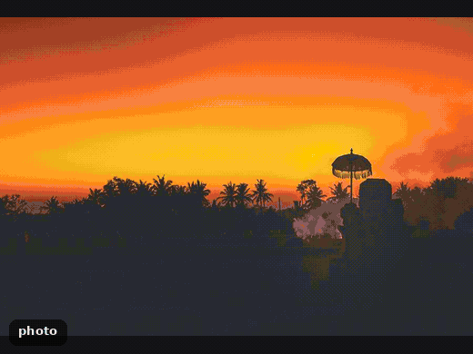
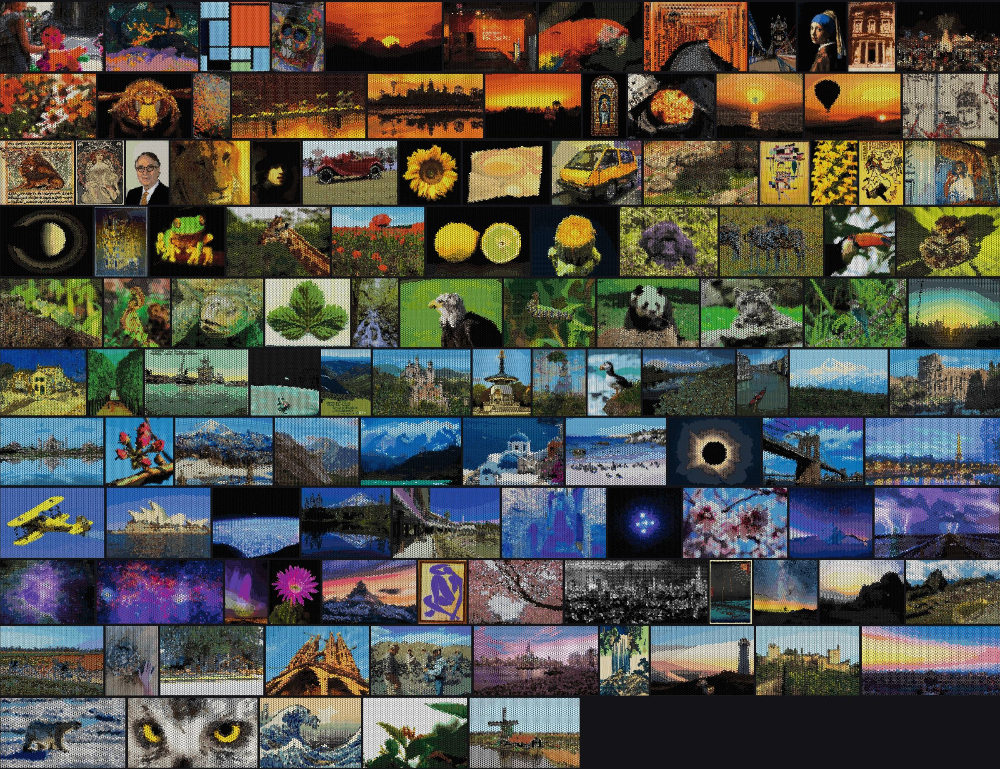

# Kumiko mosaic

**Turn any photo into a 3D-printable kumiko panel.**

Kumiko is the Japanese craft of lattice screens made of thin wooden strips. This tool plans one as a
printed wall panel: upload an image and it works out the whole build, with each triangle of the lattice
getting a coloured line insert whose colour and density reproduce the picture.


## Why use it

- **It does the planning.** Which filament, which line pattern and which background goes in every cell,
  so you aren't colouring thousands of triangles by hand.
- **It uses real filaments.** Colours come from the Bambu PLA catalogue (or the spools you list), so the
  plan is something you can actually buy and print.
- **It gives you everything to build.** Printable plate files (3MF/STL) sorted one colour per plate, a
  part count and filament estimate, and an assembly sheet that tells you what goes where.
- **It builds on Paper View's [Large Kumiko Frame Generator](https://makerworld.com/en/models/1614814-large-kumiko-frame-generator)**:
  you print his frame, this plans and generates the inserts that fill it.

## Try it

```bash
git clone https://github.com/npow/kumiko-mosaic && cd kumiko-mosaic
python3 -m venv .venv && . .venv/bin/activate && pip install -r requirements.txt
./serve.sh        # open http://localhost:8000
```

Upload a photo, click **Plan it**. Or from the command line:

```bash
python -m kumiko_mosaic.cli photo.jpg out/
```

`out/` gets the preview, `REPORT.md` (frame settings, filaments, part counts), the assembly sheet and the plate files.

## What goes in the panel

**Inserts.** Every triangle gets a flat *background insert* plus an optional *line insert*, a kumiko
pattern of thin strips. Seventeen line patterns are available at the default size, from sparse to
dense. The planner puts a sparse pattern where the image is dark and a dense one where it is bright,
and uses at most four per panel so there are fewer kinds of parts to sort.


Strips are 2 mm wide and every opening is at least 2.5 mm, so they stay lines rather than turning into
plates. Paper View's 40 original inserts can also be used (`--pattern-mode single:7`).

**Colours.** All colours are real, purchasable filaments: Bambu Lab PLA Matte and Basic, 55 in total.
The planner chooses eight for the line inserts and three for the backgrounds, whatever fits the image
best, or you can list the spools you already own.


## Examples





Open `/catalog` in the web app for the full mosaic with a zoom viewer, or see
[examples/catalog/CREDITS.md](examples/catalog/CREDITS.md) for image credits.

## Good to know

- Bold, high-contrast subjects work best. Busy or foggy scenes lose their subject.
- Size is set by the number of columns (default 40, about 1.75 m wide at 50 mm pitch). 60 or more
  columns reads as the actual picture, at several thousand parts.
- Everything is documented in [docs/reference.md](docs/reference.md): options, how colours are
  matched, resolution guide, patterns and geometry.
