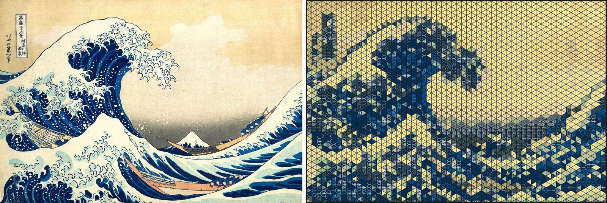
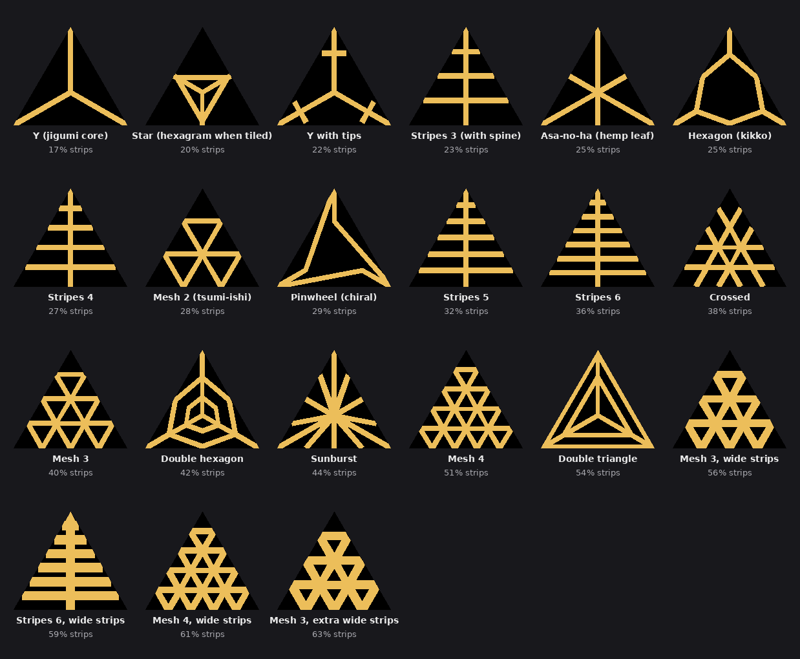
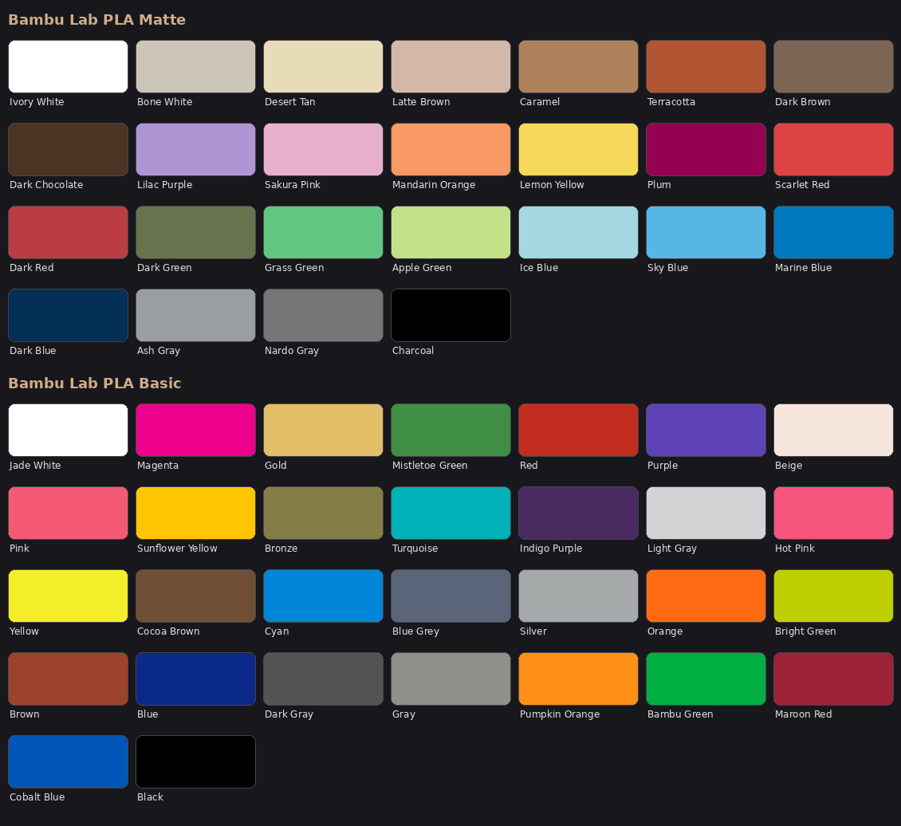
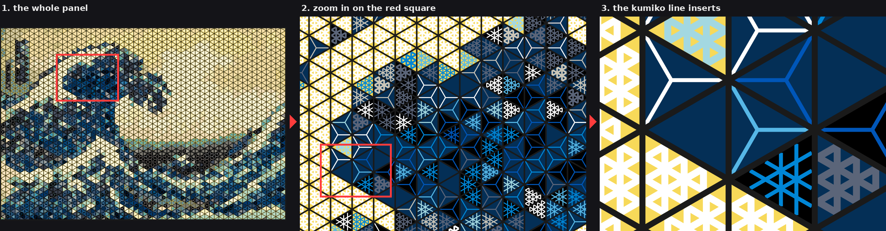
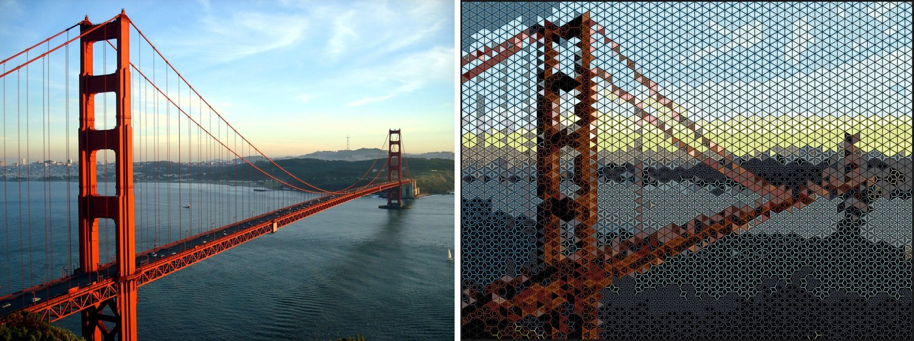
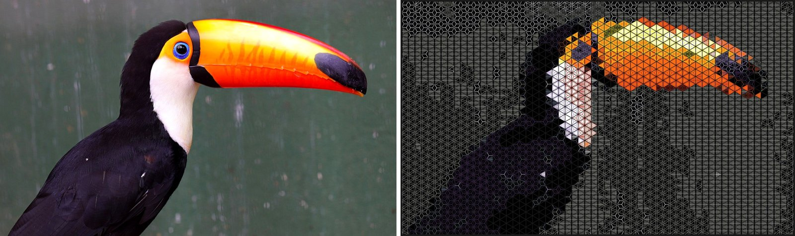
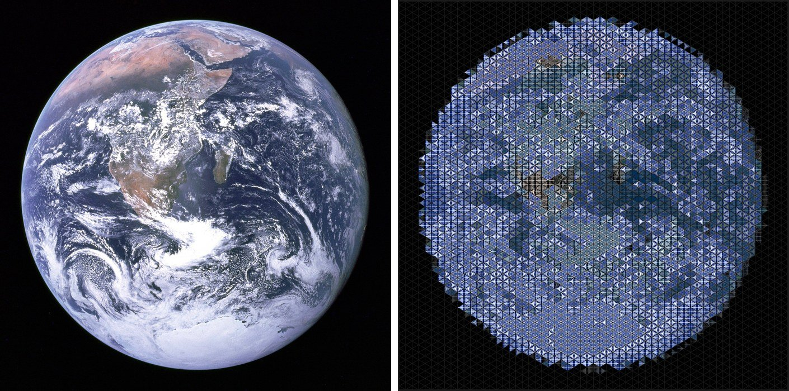
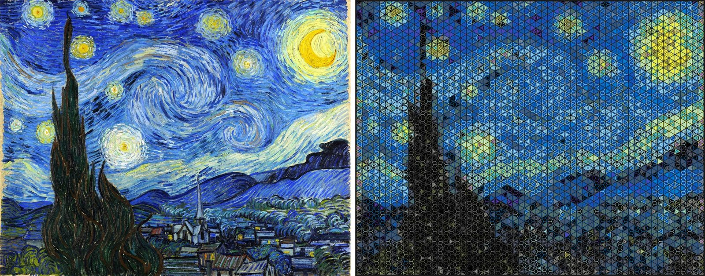
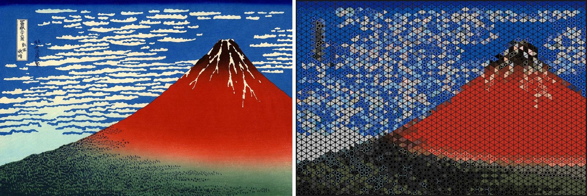

# Kumiko mosaic

Turn a photo into a 3D-printed kumiko panel.

Kumiko is the Japanese craft of lattice screens made from thin wooden strips. This tool takes an image
and plans a wall panel in that style. The panel is a lattice of triangles. Each triangle holds a
printed line insert, and the colour and density of those lines reproduce the picture.



## What it gives you

- **A plan for every triangle.** Filament, line pattern and background for each cell, so you don't
  colour thousands of triangles by hand.
- **Colours you can buy.** They come from the Bambu Lab PLA catalogue, or from a list of the spools you
  own.
- **Files to print and build with.** Plates in 3MF and STL, one colour per plate, a part count and
  filament estimate, and an assembly sheet showing which insert goes where.
- **A fit for Paper View's frame.** You print his
  [Large Kumiko Frame Generator](https://makerworld.com/en/models/1614814-large-kumiko-frame-generator)
  frame, and this tool generates the inserts that go in it.

## Try it

```bash
git clone https://github.com/npow/kumiko-mosaic && cd kumiko-mosaic
python3 -m venv .venv && . .venv/bin/activate && pip install -r requirements.txt
./serve.sh        # open http://localhost:8000
```

Upload a photo and click **Plan it**. From the command line:

```bash
python -m kumiko_mosaic.cli photo.jpg out/
```

`out/` contains the preview, `REPORT.md` (frame settings, filaments, part counts), the assembly sheet
and the plate files.

## Inserts

Each triangle gets a flat background insert and, usually, a line insert: a kumiko pattern of thin
strips. At the default size there are 21 line patterns, from sparse to dense. The planner uses a
sparse pattern where the image is dark and a dense one where it is bright, and limits a panel to four
patterns to keep the sorting manageable.



Strips are 2 mm wide and every opening is at least 2.5 mm, so the inserts stay open lines. Paper View's
40 original inserts can be used too (`--pattern-mode single:7`).

## Colours

The planner picks eight filaments for the line inserts and three for the backgrounds, whichever fit the
image best. The default source is the 55 Bambu Lab PLA Matte and Basic colours shown below. You can also
choose from an open database of PLA colours from 55 brands (Polymaker, eSun, Prusament, Sunlu, Elegoo,
Overture, Hatchbox and more), limited to the brands you buy:

```bash
python -m kumiko_mosaic.cli photo.jpg out/ --filament-set db --brands "Polymaker,eSun"
```

Or list the spools you already own and every colour in the plan will come from them.



## Zoom in

The panel is a vector drawing, so you can zoom until single inserts fill the screen. The preview on
the web app's result page does this (scroll to zoom, drag to pan, double-click to zoom in), and so
does every panel in `/catalog`. The picture below shows the idea in three steps.



## Examples

Source on the left, planned panel on the right, drawn with the real insert silhouettes. All at 60 columns (2.6 m wide at 50 mm pitch, 1.6 m at 30 mm), 8 Bambu PLA strip filaments, 3 grey background filaments, at most 4 line patterns, dark frame. The fidelity number is the mean CIELAB error at viewing distance (lower is better; under 10 reads as the picture from across a room). Rebuild with `python scripts/make_gallery.py && python scripts/readme_examples.py`.

**The Great Wave (Hokusai)**: 60 x 35 triangles, 4260 cells, 4192 pattern inserts, fidelity 11.68


**Golden Gate Bridge**: 60 x 39 triangles, 4740 cells, 4580 pattern inserts, fidelity 8.35



**Toco toucan**: 60 x 31 triangles, 3780 cells, 3488 pattern inserts, fidelity 6.88



**Earth from Apollo 17**: 60 x 52 triangles, 6300 cells, 3969 pattern inserts, fidelity 5.63



**The Starry Night (Van Gogh)**: 60 x 41 triangles, 4980 cells, 4968 pattern inserts, fidelity 9.39



**Red Fuji (Hokusai)**: 60 x 35 triangles, 4260 cells, 3404 pattern inserts, fidelity 13.56



## Notes

- Bold, high-contrast subjects work best. Busy or foggy scenes lose their subject.
- Size is set by the number of columns. The default is 40, about 1.75 m wide at 50 mm pitch. At 60 or
  more columns the picture is clearly recognisable, and the panel has several thousand parts.
- Options, colour matching, the resolution guide, patterns and geometry are in
  [docs/reference.md](docs/reference.md).

## Licence

The code is [MIT](LICENSE). The example images are derived from Wikimedia Commons photos and keep
their licences, listed in [examples/LICENSE.md](examples/LICENSE.md). The frame itself is Paper View's
and is covered by his licence; this repository does not include it.
